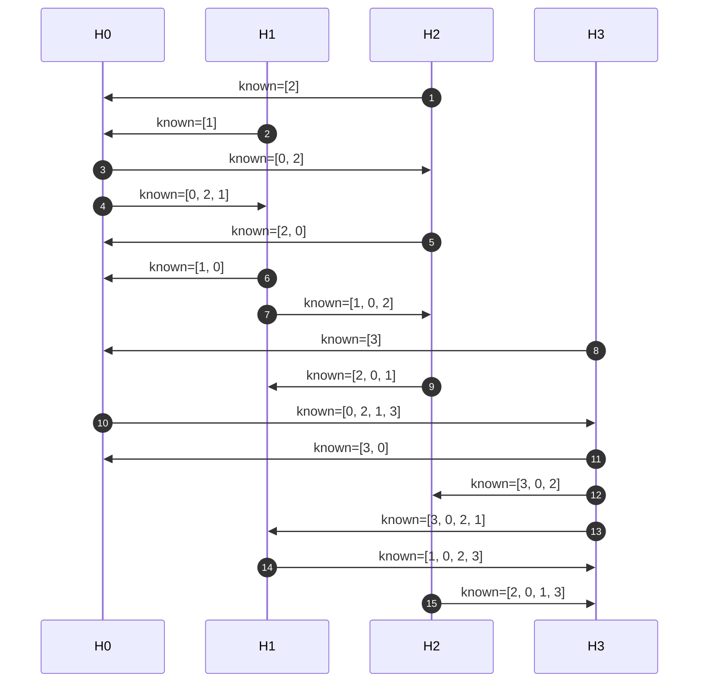

```mermaid
sequenceDiagram
autonumber
participant H0
participant H1
participant H2
participant H3
H2->>H0: known=[2]
H1->>H0: known=[1]
H0->>H2: known=[0, 2]
H0->>H1: known=[0, 2, 1]
H2->>H0: known=[2, 0]
H1->>H0: known=[1, 0]
H1->>H2: known=[1, 0, 2]
H3->>H0: known=[3]
H2->>H1: known=[2, 0, 1]
H0->>H3: known=[0, 2, 1, 3]
H3->>H0: known=[3, 0]
H3->>H2: known=[3, 0, 2]
H3->>H1: known=[3, 0, 2, 1]
H1->>H3: known=[1, 0, 2, 3]
H2->>H3: known=[2, 0, 1, 3]
```
